# Navigating Complexity with Ease: The Strength of General-Purpose Multi-Agent Systems from CAMEL.AI

# 1. Introduction to Multi-Agent System of CAMEL.AI

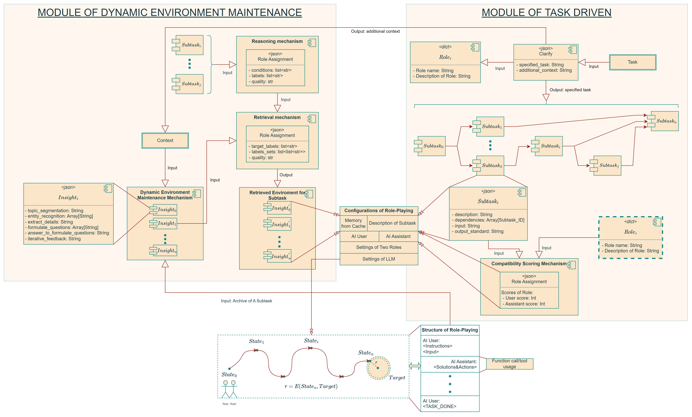

Figure 1: Framework of the Multi-Agent System

In an era where digital interfaces are integral to our daily lives, the need for seamless and meaningful human-computer interactions has never been greater. This is where the groundbreaking the Multi-Agent System comes into play, introducing a game-changer in the realm of digital communication.

The Multi-Agent System has risen as a critical solution to complex and dynamic problems in computational intelligence. CAMEL.AI, an acronym for *Communicative Agents for “Mind” Exploration of Large-Scale Language Model Society*, is an outstanding open-source community that aims to refine how AI agents interact within an AI system. The Multi-Agent System, proposed by CAMEL.AI, endeavors to meet the nuanced requirements and expectations of users and enterprises, which demand systems that are both adaptive and capable of advanced problem-solving.

The architecture of the Multi-Agent System in CAMEL.AI comprises two main modules: the **Module of Task Driven** and the **Module of Dynamic Environment Maintenance**. 

The first module is proposed to handle intricate processes that range beyond binary or linear task completion, capable of managing a sequence of interdependent subtasks (usually more than 4 steps) with varying priorities. 

The second module of the Multi-Agent System distinguishes itself by enabling a nuanced understanding of task context, thereby extending the capability of agents beyond the initiation of simple, isolated tasks. It is meticulously designed to assimilate and apply insights from prior stageable progress and additional information, facilitating a non-linear progression of tasks solving. This is particularly significant as it allows the system to process extensive inputs such as elaborate technical documents or detailed character backstories, which are often provided by users, and documented in a company. Consequently, the Multi-Agent System is empowered to **progress tasks by building upon established work**, a functionality that is notably absent in conventional frameworks. We facilitate an integrative and comprehensive approach to the task-solving process. By harnessing this collective intelligence, the system fosters an intricate environment tailored for advanced problem-solving. Subsequent sections will delve into the deployment of this module, highlighting its essential role in advancing the Multi-Agent System architecture and its substantial impact on AI's capability for intricate reasoning and strategic decision-making.

The innovation of our system lies in a multi-faceted approach, incorporating tools such as Gantt charts, concurrent calls, memory retrieval, information extraction, and pre-prompt strategies, enabling our the Multi-Agent System to address a vast majority of practical challenges. These features are not only unique and insightful but also synergistic, as evidenced by our experiments and manual evaluations, which have shown combined application to exceed the industry expectations.

Moreover, in the realm of prompt engineering within the Multi-Agent System, the essential objective is to uphold generality and versatility of the system rather than confining it to niche domains like software development. To date, the deployment of the Multi-Agent System in many problem-solving scenarios — from mathematical reasoning and modeling to novel writing, software development, and educational instruction — has yielded results that surpass anticipated effectiveness. 

Finally, to ensure the robustness of CAMEL.AI, performance is rigorously evaluated through meta-evaluation and unit testing, examining the functionality and integration of each module and feature. This systematic assessment is crucial to maintain the system’s reliability and effectiveness.

---

# 2. **Module One: Task-Driven**

## Input of Multi-Agent System

The objective of the Multi-Agent System is to maximize automation in problem-solving processes. Consequently, the Multi-Agent System will utilize a single-task prompt, similar to the existing framework, while additionally incorporating a context parameter to gather essential information. Let $Task$ be the single input task prompt, which is a specific objective to be achieved by the Multi-Agent System . The $Context$ **provides background or domain-specific information, which is essential for defining the conditions under which $Task$ **is to be executed. 

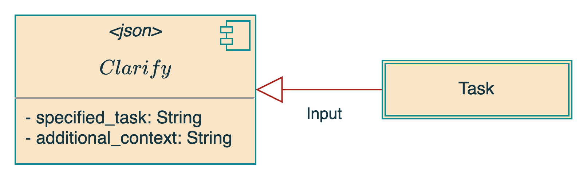

Figure 2: Clarify Agent

Before utilizing $Task$  and $Context$ parameters, in order to enhance the Multi-Agent System user interactivity, we have integrated a clarification mechanism function as a dialogue manager. This mechanism engages in multi-round interactions with users, aiming to refine the $Task$ and to augment it with additional $Context$. The Clarify Agent, central to this process, is adept at generating context-sensitive queries aimed at resolving ambiguities in $Task$. Through multiple rounds of communication, it compiles a list of question answer pairs, denoted as $QA$. Upon reaching the conclusion of the clarification phase, either when all ambiguities have been addressed or the user indicates no further clarifications, the process transitions to a refinement phase. Here, leveraging the $QA$ dataset, the agent produces two structured outcomes: a specified task prompt $Task'$ and enhanced context information $Context'$. 

```
The input task prompt is: Develop a trading bot for stock market

What specific features or functionalities would you like the trading bot to have?
(answer in text and press Enter, or "c" to move on)

Answer: 
Ability to analyze real-time and historical market data for stocks. This includes price, volume, and other relevant market indicators.

... ...

What kind of stocks or assets do you want the trading bot to focus on?
(answer in text and press Enter, or "c" to move on)

Answer: 
The trading bot should focus on high-liquidity stocks, such as those in the S&P 500 or similar large-cap indices, to ensure smooth execution of trades.

... ...

Understood. Thank you for providing detailed information about the trading bot's operations. This will help in developing a comprehensive plan for the bot's implementation. If you have any other specific requirements or considerations for the trading bot, please feel free to share.
(answer in text and press Enter, or "c" to move on)

Answer:
Nothing more to clarify.

The specified content is: {
	"specified task": "Develop a trading bot for stock market with specific features and risk tolerance",
	  
	"context": "The trading bot should be capable of analyzing real-time and historical market data for high-liquidity stocks, focusing on the S&P 500 or similar large-cap indices. It should implement a trading strategy combining technical analysis with machine learning algorithms to predict stock price movements and execute trades with a moderate risk tolerance. The bot should aim for a medium trading frequency, with an initial investment capital of $10,000 and an expected ROI of 10-15% annually over a time horizon of 3 to 5 years. Regular, weekly monitoring and oversight are envisioned to ensure alignment with the user's investment goals and risk tolerance."
}
```

From the output above, it's evident that through context-aware question and answer clarification, we successfully obtain detailed content encompassing the specified task and its contextual information. This includes crucial details gathered during the clarification process with the user, such as numerical data, motivations, strategies, and more. This demonstrates that with effective clarification, the clarify agent is adept at capturing the essential information required for subsequent execution. For the sake of simplicity, henceforth we will refer to $Task$ and $Context$ as the overarching task prompt and context information refined and augmented by clarify agent, respectively, for the Multi-Agent System input.

## Task Decomposition

Subsequently, the Multi-Agent System undertakes the decomposition of the $Task$ **into an array of subtasks*.* This decomposition is achieved in the support of $Task$, $Context$, $Role$ and number of subtasks. Therefore, before we proceed with the decomposition, we have to find the appropriate team that capable of solving the $Task$.

### Role Generation with **Description Agent**

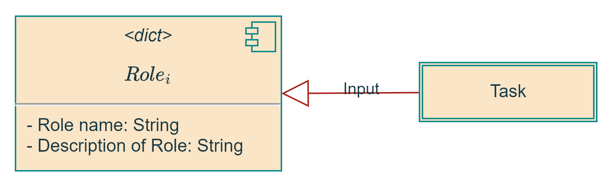

Figure 3: Role Generation

In the realm of the Multi-Agent System, the resolution of complex tasks is not just about deploying multiple agents; it's about assembling a team of diverse roles, each bringing unique expertise and capabilities to the table. Imagine a team working on a challenging project. Just as each member contributes their unique skills and perspectives, this agent provides a systematic method for pinpointing and recruiting domain experts. To acquire the appropriate team, we specify that:

1. **Specialized Expertise**, which guarantees profiling each role as a domain expert with specialized skills and characteristics, thereby enhancing the likelihood of successful task resolution.
2. **Reflecting Real-World Diversity**, which emphasizes mirroring the diverse expertise found in similar real-world job functions, ensuring a realistic and nuanced approach to problem-solving.

It ensures that every recruited role is perfectly matched with the skill set necessary for task resolution. Although some roles may appear similar, each expert will have a distinct identity, reflecting the real-world diversity in expertise within similar job functions. Users have the flexibility to determine the number of experts required based on their knowledge and operational preferences. This streamlined approach guarantees a precise and efficient team assembly, harmoniously aligning each expert’s capabilities with the task's requirements.

We use $Role = \{role_1, role_2, ..., role_n\}$ to represent the recruited team, where each role $role_i$ is to be generated based on the $Task.$ Define a role description function $Descpt$ as the role description function that produces a description for each role based on the $Task$: 

$$
Descpt: Task \oplus N → Descriptions
$$

This function takes the $Task$ and an integer $N$, outputs a set of role descriptions $\{ des_1, des_2, ..., des_n \}$. 

Overall, the role generation process, denoted by $Genrated$, takes the task and the number of roles $n$, outputs a set of roles with their descriptions:

$$
Generated(Task, n) = \{(role_1, Descpt(Task, role_1)), (role_2, Descpt(Task, role_2)),\\ ..., (role_n, Descpt(Task, role_n))\} 
$$

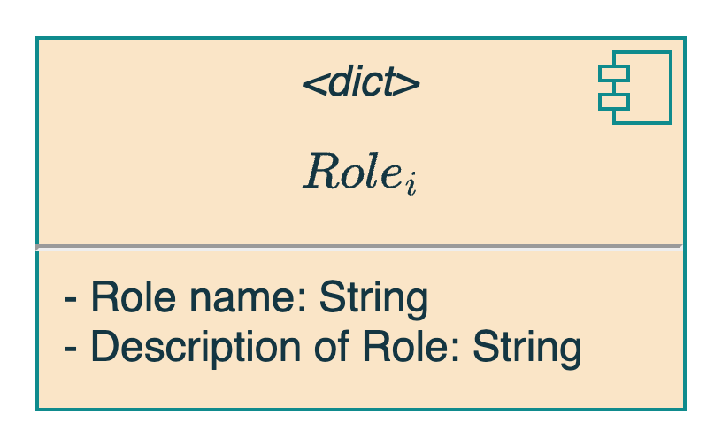

Figure 4: Generated roles with descriptions

The final output is $Team$ of a set of roles, each with a unique description tailored to the $Task$: 

$$
Team = Generated(Task, n)
$$

## Task Decomposition and Subtasks Management

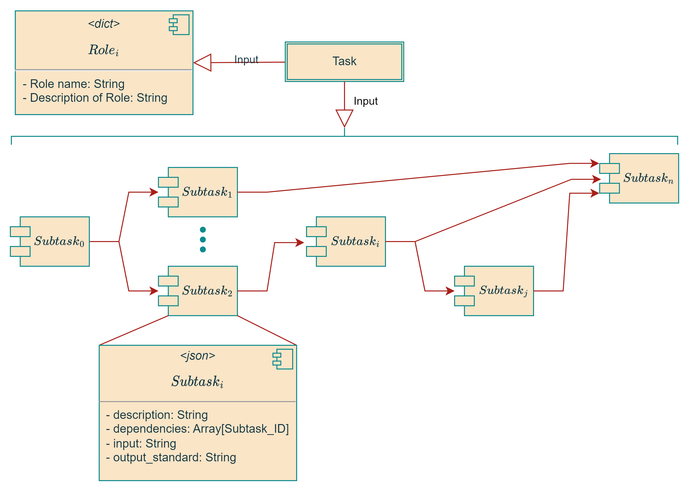

Figure 5: Task Decomposition and Subtask Management

After acquiring a $Team$ of experts suitable for the resolution of the $Task$. Now, we can delve into the subtasks decomposition process, defined as function $Dec$ that maps the $Task$, $Context$, $Team$ to a set of finer subtasks $\mathbb{S} = \{subT_1, subT_2, ..., subT_n\}$, each associated with a set of attributes:

$$
Dec (Task, Context, Team, n) \rightarrow \{(subT_i, taskDes_i, input_i, tags_i, output_i, dep_i)\}_{i=1}^n
$$

where: 

- $subT_i$ is the $i$-th subtask derived from $T$.
- $taskDes_i$ is the description of $subT_i$, extracted from the task insights and the role descriptions.
- $input_i$ is the content of the input for $subT_i$.
- $tags_i$ is a list of tags associated with $subT_i$.
- $output_i$ is the standard or criteria for the completion of $subT_i$.
- $dep_i$ is a list of dependencies for $subT_i$, indicating which other subtasks $subT_i$ depends on.

```json
Dependencies among subtasks: {
// ...
	"subtask 2": {
		"description": "- Write Chapter 2: First Leap, capturing the ship's first FTjump and the crew's reactions to anomalies.",
		"dependencies": [
			"subtask 1"
			],
		"input_tags": [
		"'Spaceship Technology'",
		"'Initial Challenges'",
		"'Early Discoveries'"
		],
		"input_content": "- Details on spaceship technology and descriptions of initial challenges and discoveries.",
		"output_standard": "- Chapter 2 is completed when the maiden voyage and initial challenges are vividly described."
	},
// ...
}
```

The task decomposition process systematically breaks down a task into smaller, atomic subtasks, each involving no more than two specialized roles. This approach ensures an effective role-playing mechanism where a user and an assistant collaborate to address the task at hand. The following guidelines outline the principles underpinning this process:

1. **Practical Subtasks**: Focus on actionable, well-defined subtasks that directly support the main task.
2. **Detailed, Action-Oriented Subtasks**: Ensure subtasks are clear and focused on specific actions, involving a small number of experts.
3. **Clear Dependencies and Planning Tools**: Emphasize logical connections between subtasks and use tools like Gantt charts for effective planning.
4. **Connected Inputs**: Maintain interconnected and adaptable inputs across subtasks.
5. **Measurable Completion Standards**: Define clear, measurable criteria for task completion to streamline workflow.
6. **Flexible Roles in Subtasks**: Avoid specific role titles in subtasks to prevent confusion and ensure clarity.

As outlined in guideline 3, in the complex world of the Multi-Agent System, managing the intricacies of task execution efficiently is paramount. Just as a well-orchestrated team in a company relies on effective planning and organization tools to streamline their workflow, our approach to managing subtask dependencies in the Multi-Agent System draws inspiration from a tried-and-tested business tool – the Gantt chart. Widely utilized in the corporate world for its efficacy in project management, the Gantt chart serves as an instrumental tool in our system. By leveraging this approach, we not only enhance the coherence and effectiveness of our task management process but also ensure that every phase of the task is executed in a synchronized and timely manner. 

The underlined Gantt chart assumes that each $subT_i$ is associated with an implicit start time $s_i$, duration $d_i$, and end time $e_i$, where $e_i = d_i + s_i$. Therefore, mathematically, each $subT_i$ can be represented as the interval $[s_i, e_i]$. Hence, we can define a dependency relation $≺$ such that for any two tasks $subT_i$ and $subT_j$. If $subT_i ≺ subT_j$, which means $subT_i$   must be completed before task $subT_j$ can start, which implies $e_i \le s_j$. Overlapping can happen if the intervals of two tasks intersect. For tasks $subT_i$ and $subT_j$, overlap occurs if $s_i < e_j$ and $s_j < e_i$. This scenario typically arises when subtasks are required to be executed concurrently, necessitating the development of a parallel execution mechanism to efficiently manage such simultaneous activities.

Hence, with the adoption of Gantt chart in subtasks management, we acquire the dependencies among subtasks $\mathbb{S}$, which clearly represents the inter-related connections of subtasks:


Figure 7: Dependency Graph

A Directed Acyclic Graph (DAG) $G(V, E)$ can be constructed from this dependencies, where each vertex $v_i ∈ V$  corresponds to a subtask $subT_i$ and a directed edge $(v_i, v_j) ∈ E$ indicates that $subT_i$ must be completed before $subT_j$ can begin, i.e., $subT_i$  is a dependency of $subT_j$. A topological ordering $\tau$ of the DAG $G$ is then determined, which is a linear ordering of $V$ such that for every directed edge $(v_i, v_j)$, $v_i$ comes before $v_j$ in $\tau$. 

$\tau(G) = [v_1, v_2, ..., v_n]$  where $(v_i, v_j) ∈ E ⟹ index(v_i) < index(v_j)$. This ordering *τ* respects the dependencies of subtasks which ensures that the subtasks can be executed without violating any dependency constraints

The structure of a DAG is fully determined by the large language model, indicating that prior to the task decomposition, the number of nodes and their interconnections within the DAG are **totally determined by the specific task to be solved**. It implies that the DAG embodies a vast array of possibilities. Such potentiality, in a way, elucidates why the Multi-Agent Systems possess versatility and generality capabilities. This concept reflects the inherent flexibility and adaptability of these systems, allowing them to efficiently manage complex tasks by dynamically organizing their internal structures based on the requirements and constraints of the task at hand. 

To enhance execution efficiency, we propose the adoption of concurrent execution strategies. This approach entails grouping together independent subtasks that are not constrained by dependencies and executing them simultaneously. Concurrent execution is applied only after ensuring that all prerequisite subtasks (those upon which they depend) have been completed. In contrast, subtasks with dependency relationships are allocated to different pipelines. These pipelines are structured to ensure independence within each pipeline while preserving the overall order of execution. Formally, let us consider $\mathbb{P} = \{P_1, P_2, ..., P_k\}$ as a set of pipelines. Each pipeline $P_i$ encompasses a collection of subtasks $\{subT_{i1}, subT_{i2}, ..., subT_{in_i}\}$ that can be executed concurrently. The sequential execution of these pipelines is mandated by the dependency relations represented by the edges in the DAG $G$. Consequently, the pipelines are executed in a strict sequence: $P_1$  followed by $P_2$, and so on, up to $P_k$. Within each pipeline $P_i$, the subtasks $\{subT_{i1}, subT_{i2}, ..., subT_{in_i}\}$ are executed in parallel. The implementation of concurrent execution significantly enhances system responsiveness and overall efficiency. By fully utilizing available resources, this method reduces response times and optimizes the execution process. This approach is particularly effective in scenarios where multiple subtasks can progress independently without waiting for others, thus accelerating the completion of the overarching task. 

For example, from Figure 5, we can tell that there will be totally 6 pipeline to be executed, and each pipeline with single or multiple subtasks included based on the dependencies of subtasks. As illustrated by the figure, $subT_1$  and $subT_2$ can be executed concurrently in $Pipeline_1$, while  $Pipeline_2$ will be executed only when all the subtasks in $Pipeline_1$  are finished and this sequential pattern continues for the subsequent pipelines.

| $Pipeline_1$ | $subT_1$ | $subT_2$ |  |
| --- | --- | --- | --- |
| $Pipeline_2$ | $subT_3$  |  |  |
| $Pipeline_3$ | $subT_4$ |  |  |
| $Pipeline_4$ | $subT_5$ | $subT_6$ | $subT_7$ |
| $Pipeline_5$ | $subT_8$ |  |  |
| $Pipeline_6$ | $subT_9$ |  |  |

In the adept management of a the Multi-Agent System, the strategic division of complex tasks into smaller, manageable segments is crucial. This methodology ensures that each subtask is allocated to agents or resources who are experts in that particular area. As a result, outcomes are enhanced because every component is overseen by specialists in their respective domains. Additionally, this subdivision into smaller parts allows for parallel processing, which markedly increases the speed and efficiency of completing the overall task. Independent progression of each segment leads to swifter task completion.

The smaller subtask units also streamlines the definition, measurement, and monitoring of progress. This increased clarity simplifies the management of tasks and improves the early detection and resolution of issues, leading to more effective resource allocation and workload distribution. In practical scenarios, a problem in one segment of a complex task could potentially disrupt the entire operation. However, by breaking tasks into smaller sections, any problems can be swiftly identified and addressed, minimizing their impact on the entire project. This approach not only speeds up the resolution of issues but also enables the prompt presentation of incremental achievements to users.

Therefore, rather than assigning multiple agents to a single complex task, we opt to decompose the task into atomic subtasks, each involving no more than two roles. This strategy enhances the clarity and explicability of the entire process, ensuring a more streamlined and effective task management approach in the Multi-Agent System.

## Role Assignment

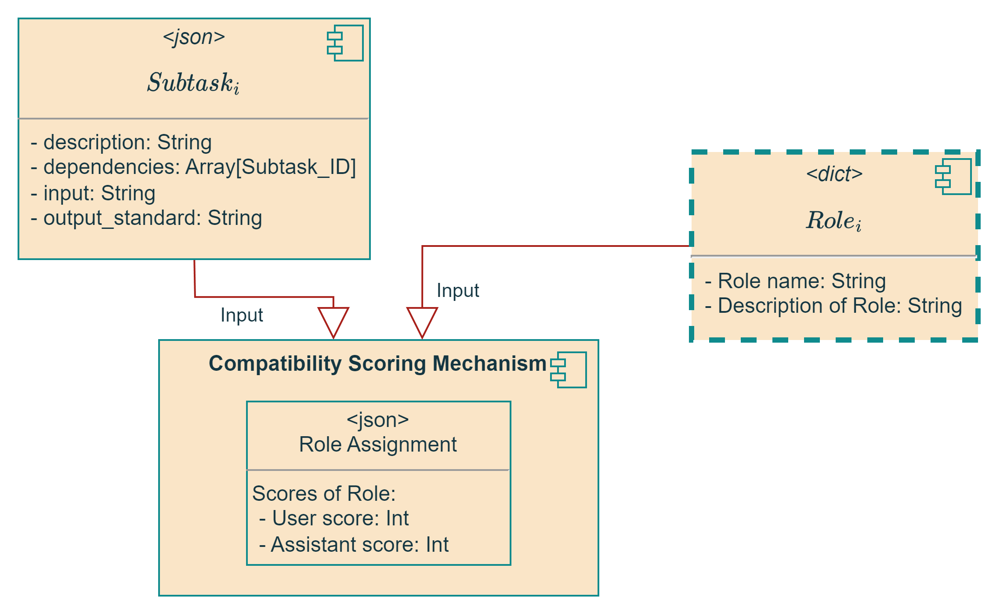

Figure 8: Role Assignment

Following the task decomposition and the subsequent generation of roles with detailed descriptions, our next step, prior to initiating the problem-solving process for subtasks, is the strategic assignment of two apt roles for each subtask. To facilitate this crucial step, we have introduced a refined compatibility scoring function, $Comp$, designed to meticulously evaluate the compatibility of each role with the corresponding subtask, $subT$. This function rigorously assesses how the responsibilities and expertise of a role align with the specific requirements of $subT$. 

For each role $role_{i}$, the process entails assigning two distinct scores: $Comp_{user}(role_i, subT)$ , and $Comp_{assistant}(role_i, subT)$, which respectively gauge the suitability of role $role_i$ for $subT$ in the capacities of a user and an assistant. These scores are quantitatively represented as integers within the range $[0,100]$. 

The criteria for evaluating these scores are comprehensive and multi-dimensional, focusing on the synergy between a role's duties and the task's demands, and the alignment of key terms and concepts in both role and task descriptions. This evaluation is structured into three distinct areas:

1. **Role-Task Alignment Assessment**: evaluates how well a role's key responsibilities and expertise align with a task's requirements and the probability of successful execution based on the role's competencies.
2. **Relevance Analysis via Keywords/Concepts**: assesses the alignment between a task and a role by examining the overlap of keywords or central concepts in their descriptions to determine the role's direct relevance to the task.
3. **Value Contribution Evaluation**: assesses the unique value each role brings to a task's successful completion, based on empirical data or established standards in the relevant domain.

Each of these areas plays a crucial role in comprehensively assessing the suitability and effectiveness of roles in relation to specific tasks, ensuring a nuanced and data-driven selection process. The compatibility scores for each role are systematically structured as follows:

$$
Score(role_i, subT) = \{score_{user}: Comp_{user}(role_i, subT), score_{assistant}: Comp_{assistant}(role_i, subT)\}
$$

Consequently, the output of this process is a comprehensive dictionary mapping each role to its calculated compatibility scores:

$$
CompatibilityScores = \{role_i: Scores(role_i,subT) | role_i ∈ Role\}
$$

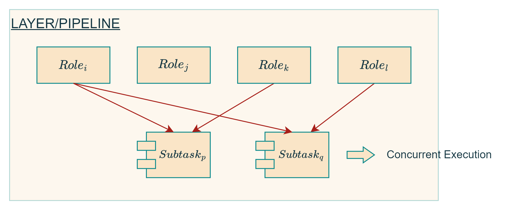

Figure 9: Layer and Pipeline of Subtasks

It's noteworthy to mention a unique scenario that can arise: the case where the $user$ and $assistant$ roles are filled by the same individual. In such instances, the compatibility assessment becomes even more crucial as it involves evaluating how a single individual can effectively juggle both guiding and executing aspects of a subtask. This scenario is quite akin to a situation where two authors are collaborating on writing a book. Let's imagine these two authors, both possessing distinct but complementary skills and knowledge. In our Multi-Agent System, this translates to a scenario where the same person assumes the dual roles of both $user$ and $assistant$. Here, the individual must seamlessly switch between providing strategic direction (as the $user$) and implementing those strategies in actual writing (as the $assistant$). In such case, the role as a writer will have the highest scores for both $user$ role and $assistant$ role, There wouldn't be a need to deliberately assign two distinct roles to differentiate between $user$ and $assistant$. This mirrors real-life situations where, in a collaborative effort like book writing, the authors are the primary contributors without the need for external roles, such as a physician in a science fiction story. This approach not only streamlines the role assignment process but also ensures a more realistic and efficient task execution in scenarios where multi-faceted roles are central.

Equipped with $CompatibilityScores$ we are then positioned to select the most suitable roles for each subtask. Our focus is on selecting those with the highest scores, whether it's for a $user$ or an $assistant$ role. Our empirical analyses have consistently shown that these $Compatibility Scores$  maintain a stable ranking in terms of role compatibility across numerous iterations. This consistency adds a layer of reliability to our scoring mechanism, proving its effectiveness and practicality in matching the most suitable roles for specific subtasks. This approach not only streamlines our selection process but also ensures that each role is optimally aligned with the task at hand, enhancing overall efficiency and performance.

---

# 3. **Module 2: Dynamic Environment/Cache Maintenance**

In our exploration of dynamic environments and role-playing within AI systems, let's consider a visual depiction of these concepts.

The figure represents a part of the system designed for maintaining a dynamic environment and structuring role-play between AI user and AI assistant. At the heart is the **Dynamic Environment Maintenance Mechanism**, it takes in **Insights** that ****process forms of text, including topic segmentation, entity recognition, and the iterative feedback necessary for the AI to learn and adapt. In fact, the mechanism's application is extensive, from adapting to user behavior in real-time to integrating the latest data or information into decision-making processes and agents’ actions.

The motivation behind such a mechanism is to make an AI agent not static but be able to **evolve with its environment**. This includes responding to new information, learning from interactions, and optimizing performance. By doing so, the agent remains relevant and effective, providing tailored responses and actions that align with the current context and the environment, which makes, for example, the long logical chain reasoning (text length of thousands of words) possible.

This mechanism underscores the importance of clear roles and structured communication in AI interactions, ensuring that complex tasks are broken down into manageable actions, guided by insights drawn from a dynamic, constantly evolving environment. As we introduced earlier, the most crucial part of a the Multi-Agent System is the task decomposition. This will result in the execution environments of different subtasks being independent of each other. For example, when calculating mathematical problems with multiple subtasks, if the previous subtask calculates a certain value and we update the environment variables accordingly, the next subtask will never be able to obtain this value. 

In addition, this mechanism can also be used for RAG (**Retrieval-Augmented Generation**). Compared to the commonly discussed memory module, the mechanism behaves more like a cache. It is more refined, accurate, and faster. It records information generated during the operation of the system and has advantages that the memory module does not have.

## Information Extraction: Insight Agent

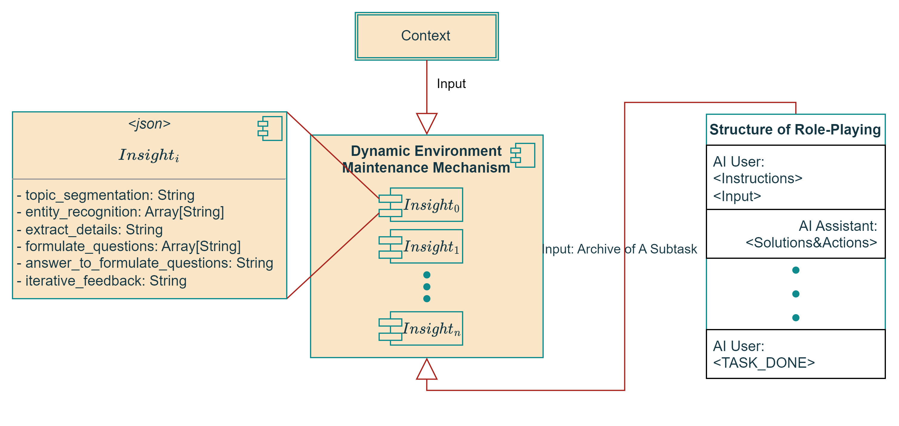

Figure 10: Dynamic Environment

As we explore the significance of the **Dynamic Environment Maintenance Mechanism**, it's crucial to understand that its effectiveness hinges on gleaning valuable insights through **Information Extraction**. This process is at the heart of maintaining and adapting to dynamic environments effectively.

Imagine the multi agent system is given a lengthy technical documentation on software development, and in order to better interact with any other agents or to better complete the subtask, one of the indispensable steps for agents is to distill this article into actionable insights. How do we approach this?

```markdown
**The Production Environment of the Acme Program System**
The Acme Program System, henceforth referred to as APS, is hosted in a state-of-the-art production environment, which has been meticulously designed to ensure optimal performance, security, and reliability.

1. **Data Centers**:
    - APS is hosted across **5** multiple geographically dispersed data centers. These data centers are strategically located in North America, Europe, and Asia to ensure seamless global access and provide redundancy.

... ...

2. **Servers:**
    - Within each data center, APS employs a cluster of **150** high-performance servers. These servers run on the latest Intel Xeon processors, equipped with DDR5 RAM and NVMe SSDs, ensuring speedy processing and data retrieval.

... ...
```

Firstly, the **Segmentation** phase kicks in. Here, we apply the $GetSeg$ function to break down the complex text $Text\_D$ into manageable segments $seg\_set = \{seg_1, seg_2, ..., seg_n\}$. 

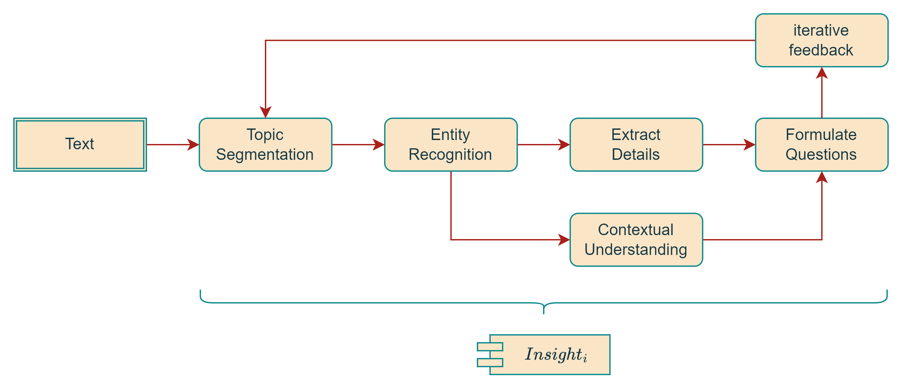

Figure 11: Workflow of **Dynamic Environment/Cache Maintenance**

Next, each segment is scrutinized for **Topic Identification**. With $topic\_id$, we sift through each $seg_i$ to pinpoint the overarching themes, effectively compiling a topic inventory $topic\_set$. For example, from the technical documentation, GPT outputs the segmentation as `Governance, and Technology Advancements`, `Environmental Sustainability and Urban Development`, etc.. 

```json
{
  "insight 1": {
    "topic_segmentation": "Data Center Infrastructure",
    "entity_recognition": [
      "\"5 geographically dispersed data centers\"",
      "\"72 CCTV cameras\""
    ],
    "extract_details": "The APS is hosted across 5 multiple geographically dispersed data centers, strategically located in North America, Europe, and Asia to ensure seamless global access and provide redundancy. Each data center is fortified with 72 CCTV cameras.",
    "contextual_understanding": null,
    "formulate_questions": "What are the specific locations of the 5 data centers hosting APS? How do the 72 CCTV cameras contribute to the security of the data centers?",
    "answer_to_formulate_questions": "The data centers hosting APS are strategically located in North America, Europe, and Asia. The 72 CCTV cameras contribute to the security of the data centers by monitoring and safeguarding entry and exit points.",
    "iterative_feedback": null
  },
  // ...
}
```

Moving on to **Entity Extraction**, where $ent\_ext$ hones in on each segment to extract key players, locations, and terminology — the 'entities' that are central to the narrative text, resulting in a set$ent\_set$. Again, for example, the GPT may output `Neo-Eden`, `IQ of 130`, `recycling rate of 95%`, etc..

Then, we take a crucial step with **Information Extraction**. Here, $info\_ext$ is the workhorse that delves into each segment, pulling out **critical data, facts, and figures** — the meat of the information we need.

After we $info\_ext$, we engage in **Context Association**. Using $ctx\_assoc$, we marry each information piece $info_i$ with the segment it came from $seg_i$, fabricating a set of contextual links $ctx\_set$. It ensures that every statistic or fact is anchored to its relevant context.

With a rich tapestry of information and context at our fingertips, we proceed to **Question Formation**. This stage is where we get inquisitive. By fusing information $info_i$ with its context $ctx_i$, we craft a lineup of pointed questions $quest\_set$ that can drive research, discussions, or even policy decisions.

After these questions spark a dialogue, we receive feedback. **Feedback Processing** takes this input and processes it through $FeedProc$, fine-tuning our output $current\_output$ to ensure it's as accurate and insightful as possible.

Lastly, we aim to see the forest for the trees with **Structured Representation**. The $StructRep$ function takes all our data sets — topics, entities, information, questions — and structures them into a coherent, insightful model $insight\_objs$, ready for decision-makers to act upon.

Each step is crucial, transforming raw text into a decision-making goldmine, enabling essential insights can be extracted from the given information.

## **Evaluation of Insight Agent**

The evaluation of an insight generation process is a critical component. By implementing a quantifiable function $Eval(Process)$, we can gauge the quality, relevance, and self-assessment of the insights generated against the original text. This function aggregates the individual assessments of each insight, ensuring a comprehensive review of the system's output.

$$
Eval(Process) = \frac{1}{N} \sum_{i=1}^{N} \left( Qual(insight_i) + Rel(insight_i, Text\_D) + SelfEval(adjusted\_output) \right)
$$

Where:

- $Qual(insight_i)$ is the quality function for the $i$-th insight.
- $Rel(insight_i, Text\_D)$ is the relevance function for the $i$-th insight with respect to the original text.
- $N$ is the number of insights generated.
- $SelfEval(adjusted\_output)$ is the self-evaluation function that the LLM uses to assess its own iterative adjustments based on internal feedback loops.

The self-evaluation function ( $SelfEval$ ) would likely involve several components:

- **Consistency Check ( $Consistency$ )**: Ensures that the insights are not contradictory and are aligned with each other.
- **Coherence Measure ( $Coherence$ )**: Evaluates how logical and well-structured the insights are within the context of the text.
- **Completeness Metric ( $Completeness$ )**: Assesses whether the insights cover all the necessary aspects of the context text without significant omissions.
- The $SelfEval$  function could then be a weighted sum of these components:
    
    $$
    SelfEval(adjusted\_output) = w_1 \cdot Consistency(adjusted\_output) + w_2 \cdot Coherence(adjusted\_output) + w_3 \cdot Completeness(adjusted\_output)
    $$
    
    Here, $w_1$ , $w_2$ , and $w_3$ are weights that determine the relative importance of consistency, coherence, and completeness in the self-evaluation process.
    
    This kind of self-evaluation is complex and assumes the model has been trained or programmed to recognize these qualities in its output. It's part of the growing field of AI safety and alignment, ensuring that models not only produce outputs that seem correct but also adhere to internal standards of quality and reliability.
    

## Dynamic Environment

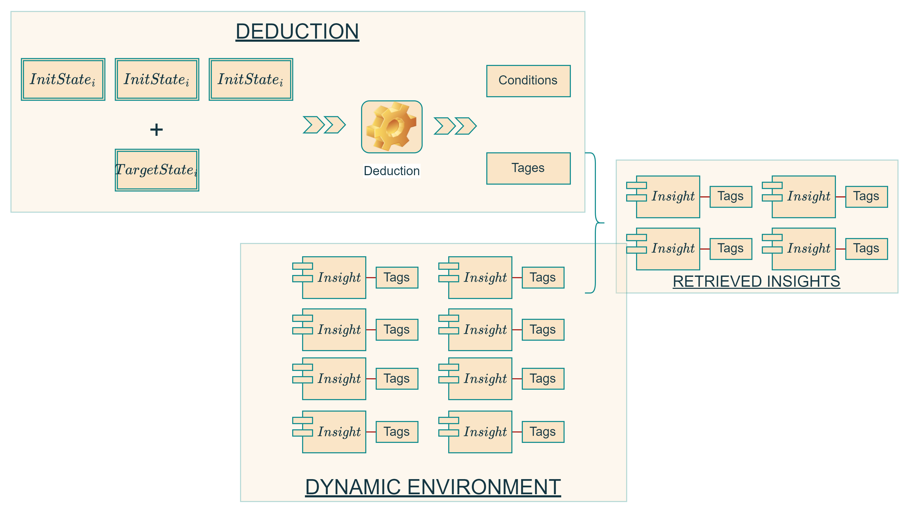

Figure 12: Structure of Dynamic Environment

The retrieval process within a **Dynamic Environment** is a multi-layered operation that hinges on the extraction and application of insights derived from user interactions and contextual data. At the outset, the process begins with **Insight Extraction**, where the model scours through role-playing chat records and user-provided contexts, distilling them into a cache of insights. This caching is not merely for storage; it serves as a preparatory step for the subsequent retrieval phase, ensuring that insights are readily accessible for future interactions.

$$
ExtractInsights(ChatRec, IptCtx) \rightarrow \text{Cache} 
$$

The next critical phase is **Conditional Inference for Task**, which is a sophisticated mechanism where the system employs a function, $InferConditions$, to discern the necessary conditions from the cached insights. These conditions are essentially tags that the system uses to identify which insights from the cache are most pertinent to the new task at hand. The system then invokes $RetrieveInsights$  to fetch these tagged insights. 

$$
Path: SubT_i^{(0)}\oplus \dots \oplus SubT_i^{(k)}\oplus Conds\rightarrow quality\otimes {SubT}_i
$$

We provide an example to help us better understand this method:

- $SubT_i^{(0)}$: "Designing the search feature's user interface"
- $SubT_i^{(1)}$: "Developing the search algorithm"
- $SubT_i^{(2)}$: "Creating the database schema for indexed data"
- $SubT_i^{(3)}$: "Developing the API for search result retrieval"
- $SubT_i^{(k)}$: "Setting up the server environment for the search engine"
- $Conds$: [”Efficient indexing”, “Robust backend”, “Accurate results”]
- $SubT_i$: “Integrating search engine”

In fact, the Conditional Inference for Task phase presents **significant challenges**, especially when the system is applied to general use cases within a multi-agent environment. The difficulty lies in the $InferConditions$ function's ability to generalize effectively across a wide array of scenarios. Each scenario may require different insights, and finding a universal set of conditions or tags that can reliably trigger the correct retrieval of insights is a complex task. The more diverse the scenarios, the harder it is for the system to deduce the exact conditions necessary for every possible task without specific tuning or contextualization. There's a delicate balance between making the system general enough to handle a broad spectrum of tasks and specific enough to provide accurate and relevant insights. This balance is often a significant hurdle in the development of such the Multi-Agent Systems. But through the careful design, our Multi-Agent System performs well.

What’s more, the retrieval is not a mere fetch operation. It involves $ReverseReasoning$, where the model considers the dependencies and paths of subtasks, represented by $SubT$, and aligns them with the conditions or tags stored within the cache. This step ensures that the insights are not only relevant but also logically consistent and coherent with the task objectives.

The culmination of this retrieval process is the $EncodePrompt$  function, which translates the retrieved insights into actionable prompts for the language learning model. This encoding is vital as it converts the insights into a format that is interpretable by the model, facilitating a seamless integration of the insights into the ongoing task-solving process.

$$
EncodePrompt(RetrievedInsight)→Prompt
$$

By intertwining these functions, the Dynamic Environment creates a feedback loop where each task interaction refines the insight retrieval process. This loop is crucial for maintaining an adaptive and responsive AI system, where the insights evolve with each task and the AI's understanding of the user's needs becomes increasingly nuanced. The result is a highly dynamic system that not only responds to the current state but also anticipates future interactions, ensuring a continually optimized and intelligent user experience.

## Evaluation of Maintenance

To evaluate the error in the process described, we can establish a mathematical model that considers the potential sources of error at each stage of the process. Here's how we could structure such a model:

1. **Error in Insight Extraction**:
    - Let $Error_{extraction}$ represent the error associated with the insight extraction process from chat records $ChatRec$ and user context $IptCtx$.
    - This error could stem from inaccuracies in natural language understanding or from missing contextual information.
2. **Error in Conditional Inference**:
    - Let $Error_{inference}$ represent the error in the conditional inference process, which could be due to incorrect tagging or failure to capture the necessary conditions from the cache accurately.
3. **Error in Prompt Encoding**:
    - Let $Error_{encoding}$ represent the error in encoding the insights into the LLM prompt, which might result from misinterpretation of insights or improper construction of the prompt.

The total error $Error_{total}$ in the process could then be estimated by aggregating these errors. Assuming that errors at each stage are independent and additive, we could express the total error as:

$$
Error_{total} = Error_{extraction} + Error_{inference} + Error_{encoding}
$$

Each of these errors can be further broken down into systematic errors (bias) and random errors (variance). For example:

By quantifying these errors, we could then apply optimization techniques to minimize them, thereby improving the overall process. Additionally, we might consider using a feedback loop where the output of the LLM (the effectiveness of the prompt) is used to iteratively refine the inference and encoding processes to further reduce error.

---

# 4. Role-Playing in Multi-Agent System

## Modeling of Role-Playing

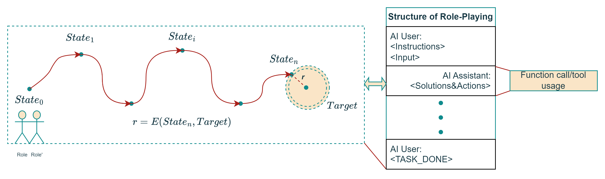

Figure 13: Path of Role-Playing

Although we have spent a lot of space in previous chapters introducing task-driven and dynamic environments, in the multifaceted realm of the Multi-Agent System, the role-playing emerges as a pivotal methodology for task allocation and execution. The process starts with defining the roles: the AI Assistant $A$ and the AI User $U$, each with distinct responsibilities. Post task decomposition, A and U adhere to the roles carved out by system messages, symbolized by $P_A$ and $P_U$ respectively, which orchestrate the task-solving conversation.

During this conversation, U issues instructions $Z_t$ and contextual information $Input$, to which A responds with actionable solutions $S_t$. This dialogical pattern is iterative, forming a cumulative conversation set $M_t$, which is continuously refined with each interaction.

In the structure of role-playing, `<instructions>` refer to the directives or commands issued by the AI User to the AI Assistant, providing guidance on what task needs to be performed. `<input>` represents the current status and context for the instruction, crucial for the AI Assistant's understanding and execution of the task.

`<solutions>` are the AI Assistant's actionable responses to the instructions, formulated based on the provided input. Finally, `<actions>` indicate the practical steps taken by the AI Assistant to enact the solution, which could involve calling APIs or utilizing tools, effectively interacting with the system or environment to achieve the desired outcome.

At last, the task completion is benchmarked against predefined criteria, ensuring that the task is only marked complete when the intended outcome is realized. To quantitatively measure this completion, the evaluation function $E(M_{t+1}, Target)$ is employed, assessing the progression towards the target completion based on the iterative conversation history.

## **Configuration of Role-Playing**

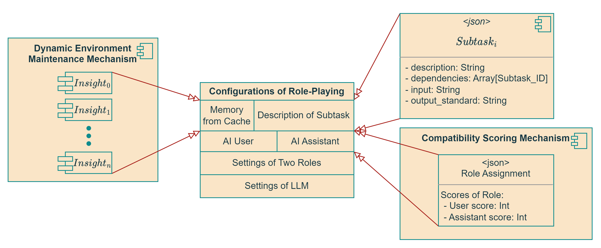

Figure 14: Configuration of Role-Playing

Transitioning from the abstract to the concrete, the configuration of role-playing within the system is foundational to the operation's success. It begins with initializing the message set $M_0$ and retrieving vital memory from the cache $Mem\_Cache$, which acts as the knowledge base or the memory for the two agents to draw from. Subtasks are then described in $Subtask\_Desc$, providing the agents with a blueprint of the tasks to be performed.

Setting the parameters for both the AI User and AI Assistant in $Settings\_Roles$ alongside the language learning model's configuration in $Settings\_LLM$ is necessary. This setup ensures that each role-player has the necessary information and api needed for the interaction.

The model can be expressed as follows:

$$
\left\{\begin{aligned}
&M_0 \leftarrow Initialize(Settings\_LLM, Settings\_Roles) \\
&Mem\_Cache \leftarrow Retrieve\_Memory(Cache) \\
&Subtask\_Desc \leftarrow Dec (Task, Context, Team, n)  \\
&\text{For each } t \text{ in interaction steps:} \\
&\quad Z_t \leftarrow User\_Instructions(M_{t-1}, Mem\_Cache, Subtask\_Desc) \\
&\quad S_t \leftarrow Assistant\_Solutions(Z_t, M_{t-1}, Mem\_Cache) \\
&\quad M_{t+1} \leftarrow M_t \cup \{ (Z_{t+1}, S_{t+1}) \} \\
&\text{If task is completed:} \\
&\quad Confirm\_Task\_Completion(M_t) \\
&\text{Evaluate:} \\
&r \leftarrow E(M_t, Target)
\end{aligned}\right.
$$


In this model, the AI User $U$ and AI Assistant $A$ interact within a defined structure, following their role settings and utilizing memory from previous interactions to guide the conversation towards the completion of a task. The evaluation function $E$ assesses the success of the communication in reaching the defined target.

## Evaluation of Role-Playing

In the context of the role-playing interaction between an AI User and an AI Assistant, the evaluation function $Eval$ could be defined to measure the deviation between the current state of the conversation $M_t$ and the target outcome. The target outcome could be a desired state where the task is completed satisfactorily.

Here's how you might define such an error function:

1. **Evaluation Function Definition:**
    - $Eval(M_t, Target)$: A function that calculates the difference between the current conversational state and the target state.
2. **Components of the Error Function:**
    - **Completeness:** Whether all parts of the task have been addressed in the conversation.
    - **Accuracy:** The correctness of the solutions provided by the AI Assistant.
    - **Efficiency:** The number of interaction steps taken to reach the target state.
    - **Coherence:** Logical consistency of the conversation flow towards the target state.
    - **Relevance:** The pertinence of the AI Assistant's solutions to the AI User's instructions.
3. **Possible Mathematical Representation:**
    
    $$
    Eval(M_t, Target) = w_1 \cdot Comp(M_t, Target) + w_2 \cdot Acc(M_t) + w_3 \cdot Ef(M_t) + w_4 \cdot Co(M_t) + w_5 \cdot Rel(M_t)
    $$
    
    Where:
    
    - $Comp(M_t, Target)$ measures the completeness relative to the target.
    - $Acc(M_t)$ measures the accuracy of the content within the current state.
    - $Ef(M_t)$ evaluates the efficiency by considering the number of steps.
    - $Co(M_t)$ assesses the coherence of the conversation.
    - $Rel(M_t)$ evaluates the relevance of the conversation to the task.
    - $w_1$, $w_2$, $w_3$, $w_4$, $w_5$ are weights that prioritize different aspects of the conversation quality.

The specific choice of metrics and their weights would depend on the context of the task and the goals of the role-playing interaction. For instance, in a customer service scenario, relevance and accuracy might be weighted more heavily, whereas in a collaborative problem-solving task, completeness and coherence could be paramount.

The error function is central to iterative improvements in AI interactions. By minimizing this error, the AI system can improve its role performance in conversations, leading to a more effective achievement of the target state.

---

# 5.  UI and Demonstration

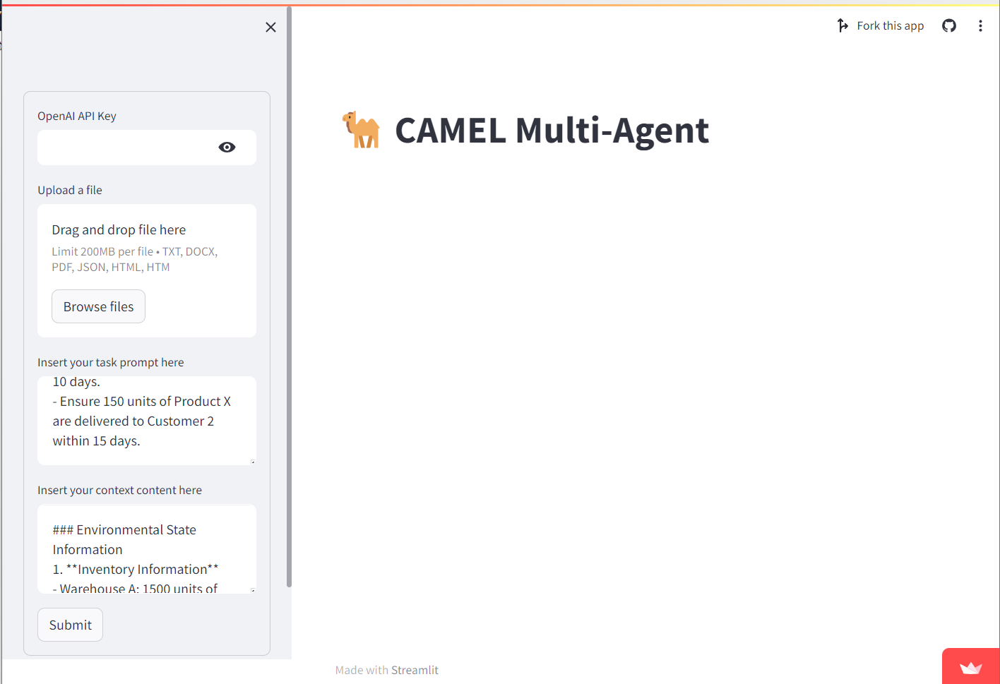

We've developed a new user interface for the Multi-Agent System in CAMEL.AI that streamlines the process of task submission. This interface features a clean and intuitive design where users can input their task prompt and context. With a dedicated area for uploading files and entering an OpenAI API key, the interface is tailored for ease of use. Users can drag and drop files into the upload section or browse for files, making it simple to provide detailed task instructions and relevant contextual information. Once the necessary information is inputted, a single “Submit” button awaits to initiate the multi-agent task processing, embodying efficiency and user-friendliness.

We can provide some demos to demonstrate how to use the Multi-Agent System, which demonstrates the versatility of the model. What is more, context will be added as users preference and can be augmented by interacting with clarify agent, due to space limitations, we will only list the content of the tasks here, feel free to design your own contexts information based on your own need.

1. Python script to generate HTML docs from GitHub codebases:
    
    Task: Create a Python script that parses source code from GitHub repositories and outputs an organized HTML documentation about the functions that the code implements under each module subdirectory. Extensions to indicate encoding format and/or structural diversity on code headers must be flagged separately.
    
2. Develop Python tool using decision trees and Monte Carlo for real estate investment strategies:
    
    Task: Creating a Python program that uses decision trees and Monte Carlo simulations to help an investor in real estate choose between renting a commercial property monthly or weekly based on market trends over a year, improving decision-making and increasing returns.
    

Task: Model the spread of a hypothetical virus in a closed population using differential equations. The virus has a unique characteristic: individuals who recover from it gain no immunity and can be immediately reinfected.

1. Solve differential equation with initial condition using numerical methods:
    
    Task: Determine the solution of the differential equation $\frac{dy}{dx} = y^2 \sin(x)$, given the initial condition $y(0) = 1$.
    
2. Model virus reinfection dynamics in a population using differential equations:
3. Craft six chapters for a business novel, structuring contextual details:
    
    Task: Write 6 chapters for a long business novel. The chapters should be structured as follows, with each chapter corresponding a subtask whose section "Incorporate Contextual Parameters into Details" begins with "Write Chapter X: ...":
    
4. Optimize delivery of products to customers within deadlines and costs:
    
    Task:  Ensure All Customer Orders Are Fulfilled Within the Stipulated Time Frame While Minimizing Total Operational Costs: - Ensure 200 units of Product X and 300 units of Product Y are delivered to Customer 1 within 10 days. - Ensure 150 units of Product X are delivered to Customer 2 within 15 days.